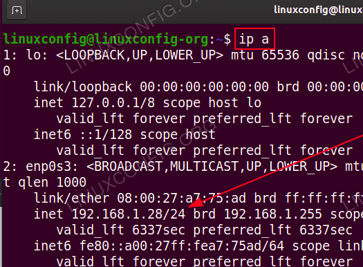
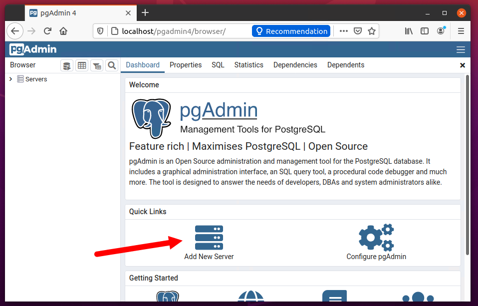

# Install and Configure PgAdmin4

[Install PGAdmin4](https://tecadmin.net/how-to-install-pgadmin4-on-ubuntu-20-04/
)

## Verify postgresql running

```bash
sudo service postgresql status
```

## Install pgadmin4 on ubuntu

```zsh
curl https://www.pgadmin.org/static/packages_pgadmin_org.pub | sudo apt-key add -
sudo sh -c 'echo "deb https://ftp.postgresql.org/pub/pgadmin/pgadmin4/apt/focal pgadmin4 main" > /etc/apt/sources.list.d/pgadmin4.list'
```

## Update the Apt cache and install pgAdmin4 package

```zsh
sudo apt update
sudo apt install pgadmin4
```

## Configure pgAdmin4-Web

```zsh
sudo /usr/pgadmin4/bin/setup-web.sh
```

Input an email address and password when prompted.

## Access pgAdmin4 Dashboard

You can access pgAdmin4 in a web browser with the following 

URL: http://server_ip/pgadmin4

To find server ip address open termina and type,

```zsh
ip a
```



Here, server ip address is *192.168.1.28*

## Add PostgreSQL Server to pgAdmin4

To add a new server, click on “Add New Server” button.




